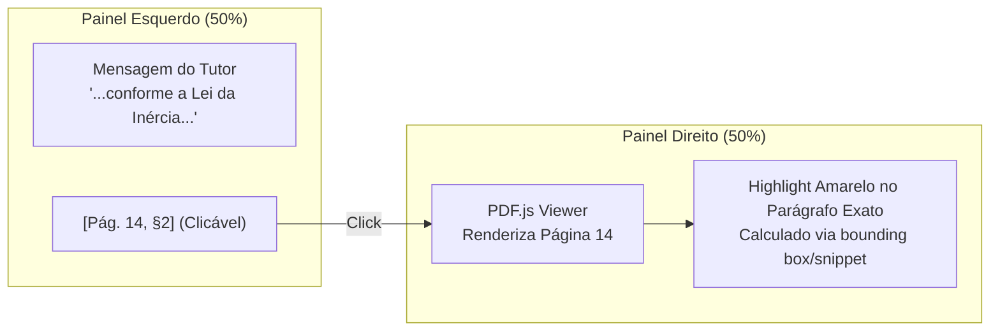
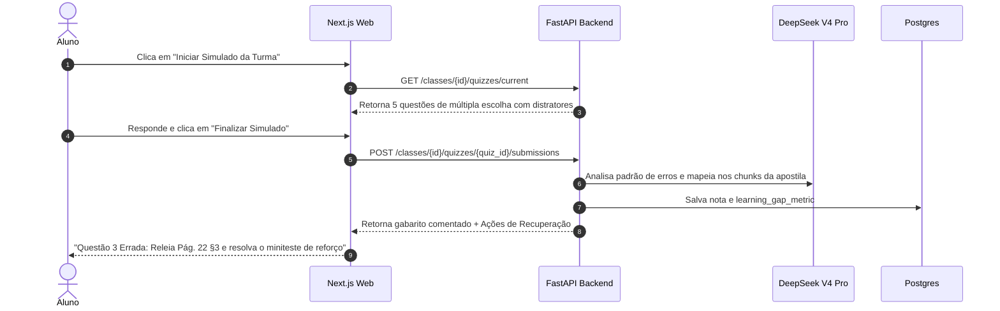
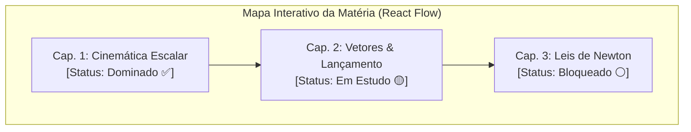

# Spec 14 — Recursos Inovadores de Impacto Global (Classroom V2)

> **Documento:** `specs/14-classroom-innovations-v2.md` · **Status:** APROVADO · **Data:** 2026-09-30
> **Finalidade:** Especificação detalhada dos recursos diferenciados para democratização e excelência pedagógica do Mentora AI para Professores e Alunos no Brasil e no mundo.

---

## 1. Visão Geral dos Recursos

Esta especificação define sete recursos de alto impacto pedagógico e tecnológico que transformam o Mentora AI de um "tutor de chat com PDF" em uma **plataforma educacional viva, inclusiva e anti-cola**:

1. **Split-Screen Evidence:** Visualizador de PDF com destaque dinâmico da fonte citada.
2. **Adaptação Curricular & Neurodiversidade:** Modos de leitura para TDAH, Dislexia e analogias conceituais.
3. **Simulado com Diagnóstico Instantâneo:** Testes objetivos que indicam exatamente a página para sanar o erro.
4. **Podcasts Didáticos de 3 Minutos:** Áudio-resumos sintéticos em pt-BR com duas vozes para estudo em trânsito.
5. **Copiloto de Planejamento de Aula:** Geração automática de roteiros de 50 minutos, quebra-gelos e dinâmicas a partir da apostila.
6. **Ficha de Bolso A4 (Inclusão Offline):** Resumo condensado em 1 página para impressão com QR Code de apoio.
7. **Gamificação Não-Tóxica (Mapa de Maestria):** Acompanhamento visual de progresso individual sem rankings predatórios.

---

## 2. Especificação Detalhada por Recurso

### 2.1 Split-Screen Evidence (Visualizador de PDF com Highlight)

* **Problema Resolvido:** Elimina o ceticismo do professor e a preguiça do aluno em abrir o arquivo original para conferir a fonte.
* **Mecanismo Técnico:**
  - O backend retorna na citação: `document_version_id`, `page_number` e `snippet`.
  - O frontend Next.js usa `react-pdf` / `pdfjs-dist`. Ao clicar na tag de citação, o leitor rola suavemente até a página informada e executa uma busca de texto no canvas da página para aplicar uma camada de *highlight* translúcido sobre o parágrafo.
* **Critério de Aceite:** Clicar em qualquer citação abre o documento correspondente em < 400ms na página exata.

---

### 2.2 Adaptação Curricular & Neurodiversidade (TDAH, Dislexia e Analogias)

* **Problema Resolvido:** Atende à obrigatoriedade legal de adaptação curricular (PEI) sem sobrecarregar as horas vagas do professor, acolhendo alunos neurodivergentes.
* **Modos de Exibição (Alternáveis na Interface do Aluno e do Professor):**
  1. **Modo TDAH / Leitura Ativa:**
     - Aplica *Bionic Reading*: primeiras letras das palavras em negrito para guiar a fixação ocular.
     - Quebra blocos de texto maiores que 3 linhas em tópicos curtos (*bullet points*) com espaçamento generoso.
  2. **Modo Dislexia:**
     - Tipografia com peso na base das letras (fonte `OpenDyslexic` ou `Lexend`).
     - Aumento de entrelinhas (1.8) e contraste de fundo ajustável (creme/sépia suave para evitar fadiga visual).
     - Botão de leitura por voz (Text-to-Speech nativo do navegador via Web Speech API).
  3. **Comando de Analogia Conceitual:**
     - Prompt contextual do `DeepSeek V4.1 Flash`: *"Reexplique o conceito da página X usando estritamente uma analogia com [futebol / culinária / música], mantendo a precisão científica dos termos."*

---

### 2.3 Simulado Inteligente com Diagnóstico de Recuperação

* **Diferencial:** Não apenas diz "certo" ou "errado". Diagnostica a confusão mental subjacente e abre o PDF no ponto exato para sanar a dúvida imediatamente.

---

### 2.4 Podcasts Didáticos de 3 Minutos (Áudio-Resumos em pt-BR)

* **Problema Resolvido:** Estudantes que passam longos períodos no transporte público ou aprendem melhor ouvindo.
* **Arquitetura de Geração:**
  1. O professor publica um novo PDF na turma.
  2. Um job assíncrono envia o texto estruturado para o `DeepSeek V4.1 Flash` com a instrução de roteirizar um diálogo natural de 400 a 500 palavras entre duas personas:
     - **Professora Helena:** Didática, segura, faz perguntas provocativas.
     - **Lucas (Aluno):** Curioso, traz dúvidas cotidianas e analogias práticas.
  3. O roteiro é sintetizado em áudio MP3 utilizando motor TTS aberto/Edge-TTS em português brasileiro.
  4. O áudio fica disponível no topo da matéria com player responsivo integrado.

---

### 2.5 Copiloto de Planejamento de Aula para o Professor

* **Problema Resolvido:** Reduz em até 70% o tempo que o professor gasta preparando planos de aula e listas de exercícios semanais.
* **Painel do Educador (`/classes/[id]/educator`):**
  - **Aba "Plano de Aula":**
    - Seleção do capítulo ou intervalo de páginas.
    - O sistema sintetiza:
      1. **Objetivo Pedagógico da Aula** (segundo as competências da BNCC).
      2. **Cronograma Minuto a Minuto** (10m Introdução, 25m Teoria central, 15m Prática guiada).
      3. **3 Perguntas Quebra-Gelo** para iniciar a discussão em sala.
      4. **1 Ideia de Experimento ou Atividade em Grupo** com materiais caseiros.

---

### 2.6 Ficha de Bolso A4 para Impressão (Modo Inclusão Offline)

* **Problema Resolvido:** Inclusão digital para estudantes de baixa renda ou com restrição de plano de dados móveis em casa.
* **Mecanismo:**
  - O sistema gera dinamicamente uma folha A4 em formato PDF (via `WeasyPrint` ou componente de impressão CSS `@media print`).
  - Conteúdo condensado:
    - Fórmulas e definições essenciais da matéria.
    - Resumo esquemático dos principais conceitos.
    - Mini-gabarito de fixação.
    - **QR Code Dinâmico:** Aponta para a thread da matéria no Mentora AI para quando o aluno tiver acesso a Wi-Fi (na escola ou biblioteca).

---

### 2.7 Gamificação Não-Tóxica (O Mapa da Maestria)

* **Princípio Anti-Ansiedade:**
  - **Proibido:** Placares públicos comparando notas de alunos (humilhação de quem tem mais dificuldade).
  - **Incentivado:** Progresso pessoal de maestria:
    - **Dias Seguidos de Estudo (Study Streak):** Acúmulo de dias com ao menos 1 interação útil.
    - **Coloração do Grafo:** Conforme o aluno resolve simulados e tira dúvidas, os nós do grafo avançam de *Cinza (Não iniciado)* ➔ *Amarelo (Em revisão)* ➔ *Verde (Conceito Dominado)*.

---

## 3. Matriz de Integração com a Stack e Modelos

| Recurso | Modelo LLM / Serviço | Onde Roda | Dependências Técnicas |
|---|---|---|---|
| **Split-Screen Evidence** | — (Metadados do RAG) | Frontend Web | `pdfjs-dist`, `react-pdf`, Tailwind |
| **Modos Neurodiversidade** | `DeepSeek V4.1 Flash` | API + Web | Fonte `OpenDyslexic`, CSS Bionic Reading |
| **Simulado com Diagnóstico** | `DeepSeek V4 Pro` | Worker + API | JSON Schema rigoroso via Pydantic v2 |
| **Podcasts Didáticos** | `DeepSeek V4.1 Flash` + Edge-TTS | Worker Assíncrono | MinIO (armazenamento MP3), Redis Streams |
| **Copiloto de Aula** | `DeepSeek V4 Pro` | API FastAPI | Prompt template formatado em Markdown |
| **Ficha A4 Offline** | `DeepSeek V4.1 Flash` | Frontend/Export | CSS `@media print` ou Puppeteer/WeasyPrint |
| **Mapa da Maestria** | Metadados de `learning_gap_metric` | Frontend Web | `@xyflow/react` (React Flow) |

---

## 4. Próximos Passos de Implementação

Estes recursos serão adicionados gradualmente nas sprints após o fechamento do **Marco 3.5**, garantindo que a fundação continue estável, testada e com 100% de evidência nos gates do CI.
