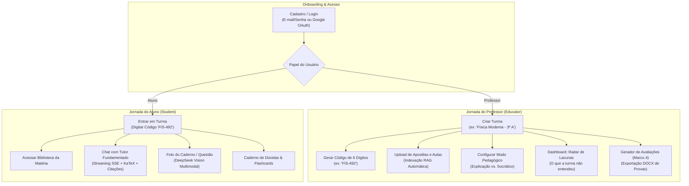
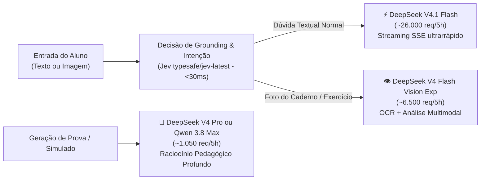
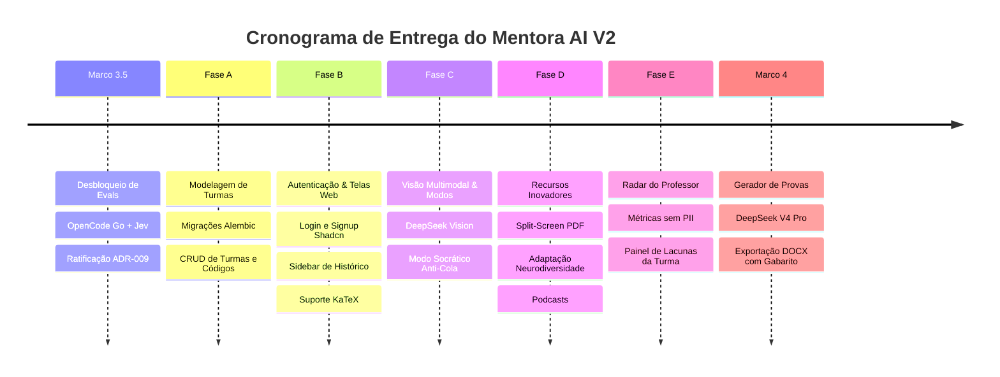

# 🎓 Mentora AI: Especificação Mestra de Produto & Arquitetura (V2)

> **Documento:** `specs/15-master-spec-v2.md` · **Status:** RATIFICADO · **Data:** 2026-09-30
> **Classificação:** Plataforma Educacional Global (Tier 2 / AI Engineer)
> **Governança:** Aderente a `GEMINI.md`, `resources.md` e padrão OpenCode Go

---

## 1. Visão de Produto & Proposta de Valor Global

### 1.1 O Conceito: *Classroom BYOC (Bring Your Own Curriculum)*
O **Mentora AI** é uma plataforma educacional aberta e escalável que resolve o abismo entre o professor sobrecarregado e o aluno que estuda sozinho.

Ao contrário de ecossistemas fechados (como Khanmigo) ou assistentes genéricos que alucinam e incentivam a cola (como ChatGPT), o Mentora AI opera sob o princípio **BYOC**:
> **Qualquer professor do mundo pode criar uma turma, carregar suas apostilas, slides e notas de aula (PDF), e oferecer aos alunos um tutor inteligente 24/7 que responde exclusivamente com base naquele material, com citação explícita de páginas e parágrafos.**

### 1.2 Os Três Pilares Invioláveis da Plataforma
1. **Fidelidade Cega à Fonte (Zero Alucinação):** Ou a resposta cita a página e o trecho exato do material da turma, ou recusa a resposta de forma educativa orientando o que fazer.
2. **Pedagogia Ativa (Anti-Cola):** O professor controla se o tutor explica diretamente ou atua em modo socrático, guiando o raciocínio sem entregar resoluções prontas de lições de casa.
3. **Radar de Lacunas (Inteligência Coletiva Sem Invasão de Privacidade):** O professor recebe análises agregadas sobre quais conceitos geraram mais dúvidas e onde a apostila falhou, sem violar a privacidade individual do estudante (LGPD).

---

## 2. Personas, Perfis e Acesso (CRUD de Usuários & Turmas)



### 2.1 Modelo de Entrada "Google Classroom" (Código de Turma)
* **Criação Rápida:** O professor cria uma turma em 30 segundos, sem aprovação burocrática da escola.
* **Código de Acesso Curto:** Cada turma recebe um código alfanumérico único de 6 caracteres (ex: `BIO-104`, `MAT-882`).
* **Ingresso do Aluno:** O aluno faz login (Google ou e-mail), digita o código e entra instantaneamente na turma, herdando acesso às apostilas e ao tutor configurado pelo professor.
* **Gestão de Membros:** O professor visualiza a lista de alunos matriculados, podendo promover monitores (`Assistant`) ou remover acessos.

---

## 3. Comportamento Pedagógico Híbrido (Configurável pelo Professor)

O professor define nas configurações da turma o **Modo Pedagógico Ativo**:

| Recurso | Modo A: Explicação Livre | Modo B: Tutor Socrático (Anti-Cola) |
|---|---|---|
| **Objetivo** | Estudo teórico, revisão e aprofundamento conceitual. | Resolução de listas de exercícios, tarefas e deveres de casa. |
| **Comportamento da IA** | Responde diretamente à dúvida, explica o tema, detalha cálculos e cita as páginas correspondentes. | **Recusa dar a resposta final ou o gabarito.** Identifica o conceito por trás da questão, aponta a página da apostila e faz uma **pergunta reflexiva** para destravar o raciocínio do aluno. |
| **Exemplo de Entrada** | *"Como funciona a Primeira Lei da Termodinâmica?"* | *"Qual é a alternativa correta da questão 4 da página 30?"* |
| **Resposta da IA** | Explica a variação da energia interna ($\Delta U = Q - W$), mostra exemplos práticos e cita o Capítulo 2 (pág. 15). | *"Não posso te dar a alternativa pronta, mas vamos pensar juntos! Olhe o gráfico de pressão por volume da página 28. O que acontece com o trabalho quando o volume não varia? Me responda isso primeiro."* |
| **Aplicação Típica** | Aulas teóricas e semanas de estudo livre. | Período de entrega de trabalhos e preparação para provas. |

---

## 4. Alocação Estratégica da Frota OpenCode Go & Decisão

Substituindo o monoprovedor Groq anterior, a arquitetura utiliza a frota de alto desempenho do **OpenCode Go** combinada com **Decision Models**:



1. **`DeepSeek V4.1 Flash` (Tutor Principal):**
   * Responsável pelo streaming diário de dúvidas (SSE token-a-token).
   * Throughput massivo (~26.000 req/5h) garantindo zero fila e custo $0 dentro da cota ativa.
   * Resposta instantânea e excelente raciocínio em exatas e humanas.
2. **`DeepSeek V4 Flash Vision Exp` (Recurso Inovador Multimodal):**
   * Permite ao estudante fotografar a folha de exercícios ou a lousa da sala.
   * A IA interpreta a imagem, transcreve a equação manuscrita e cruza com a apostila do professor indexada no Qdrant.
3. **`DeepSeek V4 Pro` (Gerador de Avaliações - Marco 4):**
   * Cria questões inéditas de alta complexidade com distratores pedagógicos plausíveis (pegadinhas que testam confusões comuns dos estudantes).
4. **`Jev (typesafe/jev-latest via OpenRouter)` (Decision Model):**
   * Custo de saída \$0.00 e latência sub-30ms.
   * Utilizado para a aresta condicional de **Grounding/Fallback**: avalia se os trechos recuperados sustentam a resposta antes de acionar a LLM geradora, garantindo a meta de **Fallback Recall ≥ 0,90**.

---

## 5. Modelagem de Dados Expandida (PostgreSQL + RLS)

Para acomodar Turmas, Código de Convite, Modos Pedagógicos e o Radar de Lacunas sem quebrar as migrações anteriores do Alembic, adicionamos as seguintes tabelas:

```sql
-- 1. Enumeração de Modos Pedagógicos
CREATE TYPE pedagogical_mode AS ENUM ('EXPLANATION', 'SOCRATIC');

-- 2. Tabela de Turmas / Salas de Aula (Classroom)
CREATE TABLE classroom (
    id UUID PRIMARY KEY DEFAULT gen_random_uuid(),
    tenant_id UUID NOT NULL REFERENCES tenant(id) ON DELETE CASCADE,
    created_by_user_id UUID NOT NULL REFERENCES "user"(id) ON DELETE RESTRICT,
    name VARCHAR(120) NOT NULL,                    -- ex: 'Física I - Eletromagnetismo'
    code VARCHAR(10) NOT NULL UNIQUE,              -- ex: 'FIS-104' (Código curto de convite)
    description TEXT,
    pedagogical_mode pedagogical_mode NOT NULL DEFAULT 'EXPLANATION',
    knowledge_base_id UUID NOT NULL REFERENCES knowledge_base(id) ON DELETE RESTRICT,
    created_at TIMESTAMPTZ NOT NULL DEFAULT NOW(),
    updated_at TIMESTAMPTZ NOT NULL DEFAULT NOW(),
    deleted_at TIMESTAMPTZ
);

-- 3. Matrícula de Usuários na Turma (com tenant_id para RLS estrito)
CREATE TABLE classroom_member (
    id UUID PRIMARY KEY DEFAULT gen_random_uuid(),
    tenant_id UUID NOT NULL REFERENCES tenant(id) ON DELETE CASCADE,
    classroom_id UUID NOT NULL REFERENCES classroom(id) ON DELETE CASCADE,
    user_id UUID NOT NULL REFERENCES "user"(id) ON DELETE CASCADE,
    role VARCHAR(20) NOT NULL DEFAULT 'student' CHECK (role IN ('educator', 'assistant', 'student')),
    joined_at TIMESTAMPTZ NOT NULL DEFAULT NOW(),
    UNIQUE(classroom_id, user_id)
);

-- 4. Vínculo de Conversas à Turma
ALTER TABLE chat_thread ADD COLUMN classroom_id UUID REFERENCES classroom(id) ON DELETE SET NULL;
CREATE INDEX idx_chat_thread_classroom_id ON chat_thread(classroom_id) WHERE deleted_at IS NULL;

-- 5. Radar de Lacunas do Professor (Métricas Agregadas sem PII, com tenant_id para RLS)
CREATE TABLE learning_gap_metric (
    id UUID PRIMARY KEY DEFAULT gen_random_uuid(),
    tenant_id UUID NOT NULL REFERENCES tenant(id) ON DELETE CASCADE,
    classroom_id UUID NOT NULL REFERENCES classroom(id) ON DELETE CASCADE,
    topic_label VARCHAR(150) NOT NULL,            -- ex: 'Leis de Newton / Atrito'
    document_id UUID REFERENCES document(id) ON DELETE SET NULL,
    page_number INT,
    question_count INT NOT NULL DEFAULT 1,
    fallback_count INT NOT NULL DEFAULT 0,        -- Casos onde a apostila não cobriu a dúvida
    negative_feedback_count INT NOT NULL DEFAULT 0,
    recorded_date DATE NOT NULL DEFAULT CURRENT_DATE,
    UNIQUE(classroom_id, topic_label, recorded_date)
);

-- 6. Caderno de Estudos / Flashcards Automáticos do Aluno (com tenant_id para RLS)
CREATE TABLE student_flashcard (
    id UUID PRIMARY KEY DEFAULT gen_random_uuid(),
    tenant_id UUID NOT NULL REFERENCES tenant(id) ON DELETE CASCADE,
    user_id UUID NOT NULL REFERENCES "user"(id) ON DELETE CASCADE,
    classroom_id UUID NOT NULL REFERENCES classroom(id) ON DELETE CASCADE,
    source_message_id UUID REFERENCES message(id) ON DELETE SET NULL,
    front_prompt TEXT NOT NULL,                   -- Pergunta de fixação
    back_answer TEXT NOT NULL,                    -- Resposta e citação da página
    review_status VARCHAR(20) NOT NULL DEFAULT 'pending' CHECK (review_status IN ('pending', 'mastered')),
    created_at TIMESTAMPTZ NOT NULL DEFAULT NOW()
);

-- 7. Ativação de Políticas RLS em Todas as Novas Tabelas
ALTER TABLE classroom ENABLE ROW LEVEL SECURITY;
CREATE POLICY classroom_tenant_isolation ON classroom
    USING (tenant_id = mentora_current_tenant_id());

ALTER TABLE classroom_member ENABLE ROW LEVEL SECURITY;
CREATE POLICY classroom_member_tenant_isolation ON classroom_member
    USING (tenant_id = mentora_current_tenant_id());

ALTER TABLE learning_gap_metric ENABLE ROW LEVEL SECURITY;
CREATE POLICY learning_gap_metric_tenant_isolation ON learning_gap_metric
    USING (tenant_id = mentora_current_tenant_id());

ALTER TABLE student_flashcard ENABLE ROW LEVEL SECURITY;
CREATE POLICY student_flashcard_tenant_isolation ON student_flashcard
    USING (tenant_id = mentora_current_tenant_id());
```

> **Garantia de Isolamento:** A inclusão mandatória de `tenant_id` em todas as tabelas e o uso da função `mentora_current_tenant_id()` garantem que, mesmo em consultas complexas ou subqueries, uma instituição nunca terá visibilidade dos dados de outra.

---

## 6. O Histórico Inteligente: Valor para Aluno e Professor

### 6.1 Para o Aluno: "Minha Memória de Estudos"
1. **Histórico de Threads Filtrável por Turma:**
   * O aluno alterna entre suas matérias (ex: *"Química"*, *"Cálculo"*).
   * A barra lateral lista as conversas passadas com títulos automáticos gerados pelo modelo.
2. **Trechos Salvos e Caderno Digital:**
   * Cada citação recebida em uma resposta possui um botão de "Salvar no Caderno".
   * O aluno monta um resumo dos pontos mais importantes da apostila organizados por assunto.
3. **Flashcards Automáticos de Dificuldade:**
   * Quando o aluno dá feedback negativo (`👎`) ou pede para o tutor explicar o mesmo assunto repetidas vezes, o sistema pergunta: *"Quer criar um flashcard deste ponto para revisar amanhã?"*.

### 6.2 Para o Professor: "Radar de Lacunas da Turma"
1. **Sem Invasão de Privacidade (Zero Vigilância Individual):**
   * O professor **não lê** os chats privados dos alunos para não inibir o estudante tímido de tirar dúvidas básicas.
2. **Inteligência Coletiva Acionável:**
   * O dashboard compila os tópicos em agregados semanais:
     * **Top Dúvidas da Semana:** Os 5 conceitos com maior volume de perguntas.
     * **Alerta de Lacunas na Apostila:** Notificação de perguntas que acionaram fallback por ausência de conteúdo no material anexado.
     * **Taxa de Utilidade:** % de respostas avaliadas positivamente pelos alunos.

---

## 7. Interface Web & Experiência de Uso (Next.js 15 + Shadcn UI)

### 7.1 Telas Principais do Sistema

```
/ (Landing Page / Login)
├── /auth/login (E-mail/Senha + Google OAuth)
├── /auth/signup (Seleção: Sou Aluno / Sou Professor)
│
├── /dashboard (Hub Principal)
│   ├── /dashboard/classes (Minhas Turmas: 'Entrar com Código' ou 'Criar Turma')
│   │
│   ├── /classes/[id]/tutor (Chat do Aluno)
│   │   ├── Sidebar de Histórico de Conversas
│   │   ├── Painel Central de Streaming com KaTeX (fórmulas)
│   │   ├── Botão de Câmera/Anexo de Foto (DeepSeek Vision)
│   │   └── Citações Clicáveis em Card Lateral
│   │
│   ├── /classes/[id]/materials (Biblioteca da Turma)
│   │   └── Lista Virtualizada de PDFs com Status de Ingestão
│   │
│   └── /classes/[id]/educator (Painel Exclusivo do Professor)
│       ├── Configuração de Modo Pedagógico (Explicação vs. Socrático)
│       ├── Código de Convite da Turma (com botão de cópia)
│       ├── Radar de Lacunas (Gráficos Recharts de Tópicos Críticos)
│       └── Gerador de Exercícios (Marco 4) com exportação .docx
```

### 7.2 Suporte a Notação Científica e Visualizações
* **Fórmulas com KaTeX:** Fórmulas como $\int_a^b f(x)dx$ ou $E_k = \frac{1}{2}mv^2$ são renderizadas nativamente na janela de chat, essenciais para estudantes de exatas.
* **Mapa de Conhecimento com React Flow:** Na aba da matéria, o aluno pode clicar em "Ver Mapa da Matéria", que desenha um grafo de nós com os tópicos da apostila.

## 8. Recursos Inovadores de Impacto Global (Classroom V2)

Para garantir diferenciação mundial e adoção espontânea por professores e alunos, os 7 recursos detalhados na [Spec 14](./14-classroom-innovations-v2.md) foram ratificados:

1. **Split-Screen Evidence:** Ao clicar em uma citação, abre um visualizador de PDF lado a lado com o chat, aplicando destaque (*highlight*) amarelo instantâneo no parágrafo exato de onde a resposta foi extraída.
2. **Adaptação Curricular & Neurodiversidade:** Modos de acessibilidade com Bionic Reading (para TDAH), fonte e espaçamento especiais (para Dislexia) e reexplicação via analogias cotidianas sob demanda.
3. **Simulado com Diagnóstico Instantâneo:** Ao finalizar um teste, a IA não só indica a nota, mas aponta a página exata da apostila para corrigir a defasagem e sugere uma questão de reforço.
4. **Podcasts Didáticos de 3 Minutos:** Geração automática de áudio-resumos em pt-BR com duas vozes sintéticas (professora e aluno) para estudo no trânsito ou revisão rápida.
5. **Copiloto de Planejamento de Aula:** O professor gera em 1 clique roteiros de 50 minutos alinhados à BNCC, perguntas quebra-gelo e dinâmicas práticas a partir do material enviado.
6. **Ficha de Bolso A4 (Modo Offline & Inclusão):** Resumo condensado de 1 folha para impressão com QR Code dinâmico, garantindo que alunos sem internet contínua em casa continuem estudando.
7. **Gamificação Não-Tóxica (Mapa de Maestria):** Acompanhamento visual de progresso individual por tópicos dominados no grafo (React Flow), sem rankings comparativos que geram ansiedade.

---

## 9. Roadmap Faseado de Implementação



| Fase | Entregáveis Técnicos | Critério de Aceite |
|---|---|---|
| **Marco 3.5** | Concluir evals Ragas com `DeepSeek V4.1 Flash` e calibrar fallback com `Jev`. | Faithfulness ≥ 0,85 e Fallback Recall ≥ 0,90 em `evals/reports/`. ADR-009 ratificado. |
| **Fase A** | Criar migração Alembic para `classroom`, `classroom_member`, `learning_gap_metric`. Endpoints de CRUD de turmas e validação de código de 6 dígitos. | Testes unitários de isolamento cross-classroom passando no `pytest`. |
| **Fase B** | Implementar interface Next.js 15 com Tailwind CSS e Shadcn UI: telas de Login, criação/ingresso de turma e chat com KaTeX e streaming SSE. | `npm run web:lint` e `npm run web:build` sem erros. |
| **Fase C** | Integração do `DeepSeek V4 Flash Vision Exp` para envio de fotos e prompt condicional de **Modo Socrático vs. Explicação**. | Testes e2e de recusa a gabaritos diretos no modo socrático. |
| **Fase D** | Split-Screen Evidence (PDF.js com highlight), Modos de Neurodiversidade (TDAH/Dislexia) e Ficha A4 para impressão. | Renderização de PDF sincronizada com citações no chat. |
| **Fase E** | Agregação de telemetria sem PII e tela de **Radar de Lacunas do Professor** (Recharts). | Relatório de tópicos e alertas de material renderizados no painel do educador. |
| **Marco 4** | Endpoint de geração de simulados/provas fundamentadas usando `DeepSeek V4 Pro` e geração de `.docx` em memória. | Documento Word formatado gerado com 100% das questões ancoradas em páginas reais. |

---

## 10. Registro de Governança & Próximas Sessões

Este documento consolida a arquitetura funcional e técnica completa discutida. Quando iniciarmos as sessões de implementação prática, a ordem de execução recomendada é:

1. **Sprint 1:** Executar o script de evals com OpenCode Go para formalizar o fechamento do **Marco 3.5**.
2. **Sprint 2:** Criar a migração do banco para **Turmas (Classrooms)** e seus endpoints FastAPI.
3. **Sprint 3:** Construir as telas de **Auth, Turmas e Chat com KaTeX** no Next.js com Shadcn UI.
4. **Sprint 4:** Implementar o **Modo Socrático e a Visão Multimodal** com o OpenCode Go.
5. **Sprint 5:** Integrar o **Split-Screen Evidence e Modos de Acessibilidade**.
